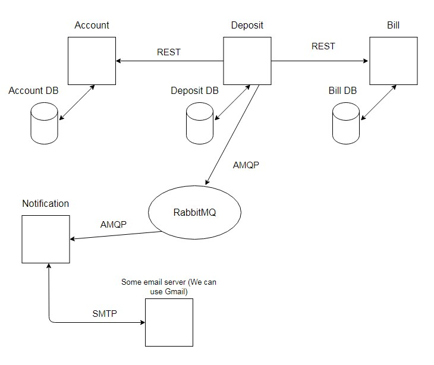

# Spring Cloud Microservices

В данном проекте реализовано микросервисное приложение,
имитирующее работу банка.

1. Бизнес-логика приложения.
 

2. Архитектура приложения со всеми микросервисами.
 

Account сервис управляет учетными записями клиентов.

Bill сервис управляет счетами привязанными к учетным записям клиентов.

Deposit сервис управляет внесением депозитов на счета клиентов.

Notification сервис уведомляет письмом на email о внесении на депозит.

Config сервис хранит настройки для остальных сервисов.

Discovery сервис регистрирует остальные сервисы и делится их адресами.

Gateway сервис перенаправляет запросы от клиентов к запрашиваемым сервисам.

RabbitMQ - брокер сообщений для передачи сообщений от Deposit сервиса в Notification сервис.

Каждый из сервисов Account, Bill, Deposit имеет собственную базу данных (PostgreSQL).


3. Доменные модели приложения: учетная запись клиента, банковский счет и депозит.
 

Поддерживаются следующие методы:

GET {localhost/IP address}:8989/accounts/{accountId} - получить учетную запись по id;

POST {localhost/IP address}:8989/accounts/ - создать учетную запись клиента;
````
{
    "name": "Baxter",
    "email": "baxter@cat.xyz",
    "phone": "+79373333333",
    "bills": [
        1
    ]
}
````

PUT {localhost/IP address}:8989/accounts/{accountId} - обновить учетную запись по id
````
{
    "name": "BaxterUPD",
    "email": "baxter@cat.xyzUPD",
    "phone": "+79373333333UPD",
    "bills": [
        1
    ]
}
````

DELETE {localhost/IP address}:8989/accounts/{accountId} - удалить учетную запись по id;

GET {localhost/IP address}:8989/bills/{billId} - получить счет по id;

POST {localhost/IP address}:8989/bills/ - создать счет;
````
{
    "accountId": 1,
    "amount": 5000,
    "isDefault": true,
    "overdraftEnabled": true
}
````

PUT {localhost/IP address}:8989/bills/{billId} - обновить счет по id
````
{
    "accountId": 1,
    "amount": 10000,
    "isDefault": false,
    "overdraftEnabled": false
}
````

DELETE {localhost/IP address}:8989/bills/{billId} - удалить счет по id;

GET {localhost/IP address}:8989/bills/account/{accountId} - получить все счета по id учетной записи;

POST {localhost/IP address}:8989/deposits - внести депозит по id учетной записи или счета,
если указать id учетной записи, то приложение найдет счет этой учетной записи, помеченный как
"по умолчанию/isDefault" и внесет депозит на этот счет;
````
{
    "billId": 1,
    "amount": 5000
}
````
или
````
{
    "accountId": 1,
    "amount": 5000
}
````

Настройка и запуск приложения.

Перед запуском, в папке:

config-service/src/main/resources/services

в файлах:

account-service.yml

bill-service.yml

deposit-service.yml

нужно прописать localhost или ваши IP адреса, учетные данные пользователей баз данных, и затем сделать clean/build

Далее в Docker нужно находясь в корневой папке проекта набрать:

docker-compose build

а затем запустить командой

docker-compose up
